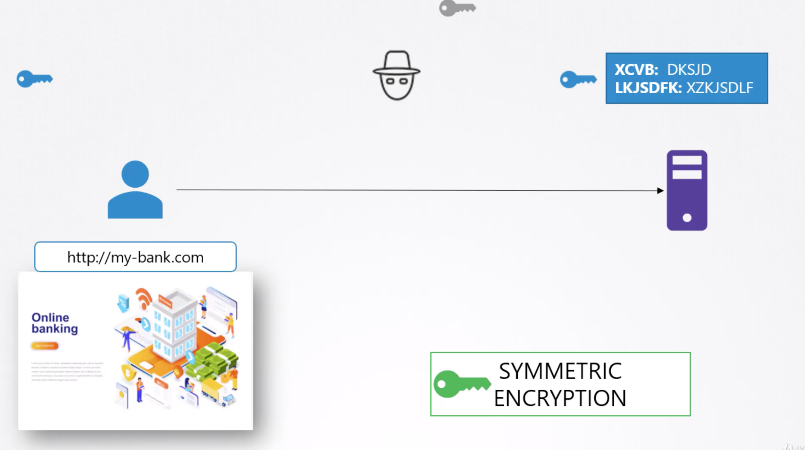
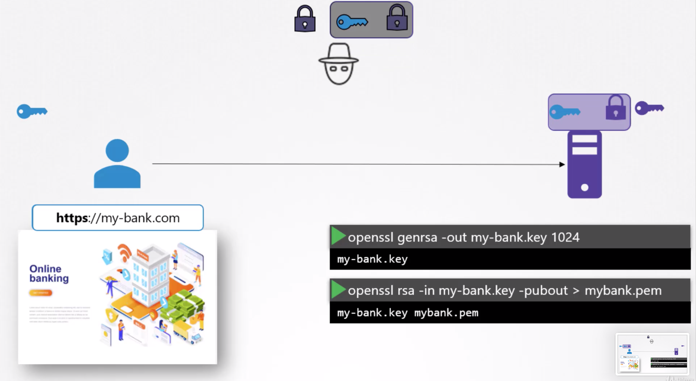
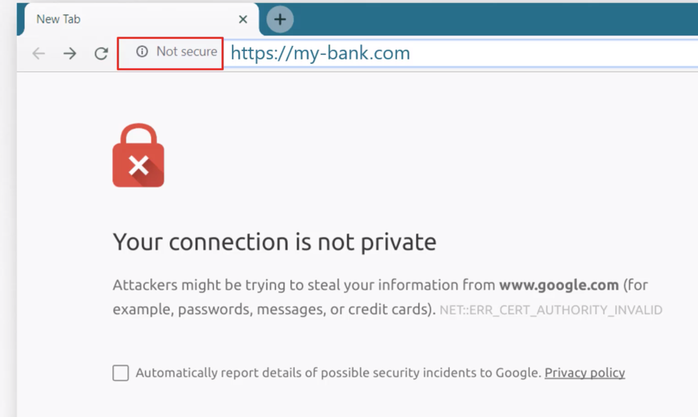
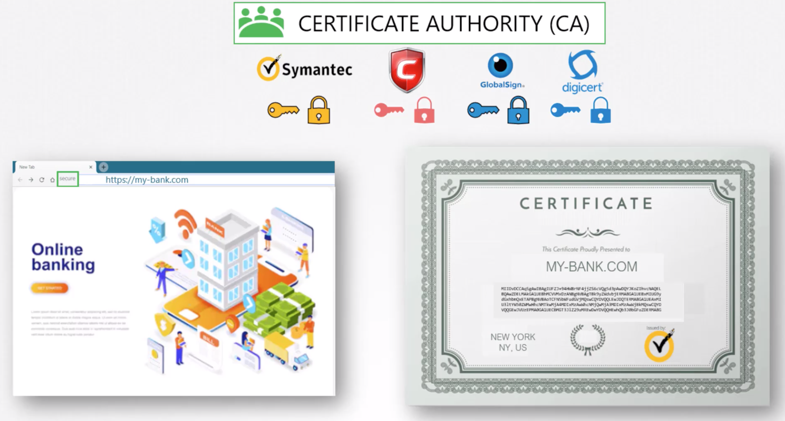
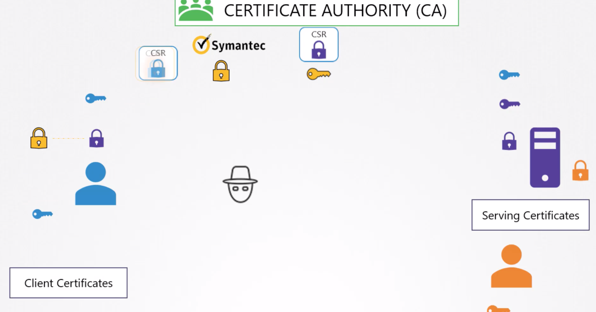

# Certificate
- Is used to guarantee trust between two parties
# Hacker stealing data over HTTP

# How to make it safe?
## Encrypt data using random generated key
- Encrypt data using key

- Send encrypted data over network 

Both server and hacker will get encrypted data
- Send copy of key over network 

Both server and hacker will get the key
- This is example of symmetric encryption key

i.e. same key is used for encryption and for decryption
## Asymmetric encryption
- uses pair of key
- private key and public key
- For better understanding, we can call it private key and public lock
- key is only with sender so private, lock is available with everyone so public
How it works?
- encrypt your data using public lock (key)
- Those who has private key can unlock the data

# Asymmetric encryption SSH

- Don't want to use password as it's risky to get hacked
- You decided to use public/private key
- Generate using `ssh-keygen`
    - private key
    - public key/lock

- Lock your serer using public lock

- Decrypt data sent by server using private key

- Connect to multiple servers by applying same lock

- What if other user needs access of server?
    - They will do same thing
    - Generate public/private key

# How to send random generated key to send to server?
- somehow send key safely to the server

- Once key is send safely then server and client can continue communication securely using shared private key
- To securely send key to server, we use asymmetric encryption
- Server generate private and public key 

- On starting handshake, server first sends the public lock/key to client 

- hacker and client both receives the public lock
- client encrypt key using public lock

- client sends encrypted key to server

hacker also gets the data but no use
- server decrypt key using private key

- Client and server continue secure communications

# Hacker breaking secure communication
- Use fishing email to capture user data
- Creates site exactly same as your bank site

- hosts site on his own server
- He wants you to think that its secure too, so he generates his own public/private key

- You now sends your real data in encrypted format

# How to make it more secure (TLS)?
- Add certificate along with public key and let client to validate it

- For web server, certificate `CN` must be same as URL

- If bank is known by multiple url then these should be defined in `Alternative Names` 
- Anyone can generate certificate like this :-) 
- You can generate one for yourself and say that you are google
- So, how to validate certificate who signed and issued?

# How to secure certificate generation?
- If you generate the certificate then you can signed it, this is known as self signed certificate.
- Certificate generated by Hacker will be self signed, you can check to verify
- Browser does for us

- How to create legitimate certificate so that browser can validate it?
- By signing from signing authority or CA

- Following are steps 
    - Generate certificate singing request 
    
    - CA validate information
    
    - CA signed information
- What if certificate is signed by fake CA

- How browser will know that certificate is signed by Symantic not by other CA?
    - CA itself has public and private certificate
    
    - CA uses private key to signed certificate
    - CA's public certificates are installed into browser
    
    - Browser uses these public keys to validate if certificate is valid or not
# How to manage certificates for internal sites?
- hosts your own private Symantic as an CA

- Install public key on your employees browser/operating system

# Recap
- client and server

- Admin generate ssh certificates to lock the server

- Server generates public/private key and csr and ask CA to sign it

- Server sends csr to CA

- CA signed csr using private key

- During TLS communication, server send signed csr to client

- Client uses preinstalled CA public key to unlock signed csr and continue TLS

# Secure client (MTLS)
- What if hacker impersonate client ?

- Client generates pub/private/csr and send csr to CA

- Client sends signed csr to server

- Server validate client and continue TLS

# PKI

# public and private key 
- Public and private keys are exchangable 

- Following are few file format of pub/private keys

# How java/node.js/python perform tls?
- OS is bundled with public keys of CAs
- If csr exchanged can be validated using preinstalled CA pub keys then good
- Installed certs in either predefined locations or custom location
# Certificate chain
- certificate can be singed by multiple CAs
    - Root certificate
    - Server certificate
    - Client certificate

# K8 certificates

# CA certs using OPENSSL

# Client using CA certs

# Use certs to create user account
- Add group details in the csr

